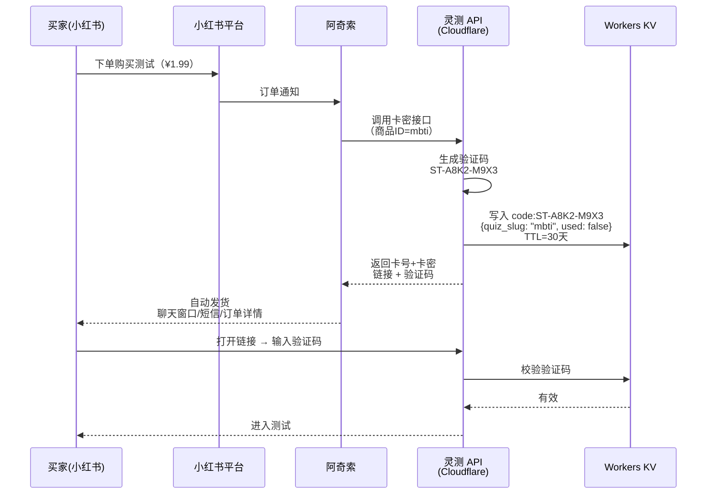

## 📌 概述

本文档整理自阿奇索（Agiso）官方开发文档，涵盖「标准系统」货源方对接指引与开放平台 API 接入规范，为灵测 SoulTest 项目的自动发货环节提供技术参考。

**核心结论**：阿奇索支持 **API 回调式动态发货**（「自有货源 - 标准系统」模式），无需预存验证码，下单时实时调用我们的 API 生成验证码并发货。

**当前项目判断**：该方案适合作为增长阶段升级路径，但 **MVP 阶段先不上阿奇索对接**，只保留接口模型与数据结构扩展点；首期先用单题集通用码验证成交和交付闭环。

---

## 1️⃣ 阿奇索产品体系

| 产品 | 定位 | 与我们的关系 |
| --- | --- | --- |
| **阿奇索自动发货** | 电商平台自动发货软件，支持淘宝/拼多多/闲鱼/京东/小红书等 | 核心工具：监听小红书订单 → 触发发货 |
| **91卡券仓库** | 跨平台统一卡券/库存管理系统 | 配置货源接口、管理发货规则 |
| **开放平台** | API 开发者平台（[open.agiso.com](http://open.agiso.com)） | 注册应用、获取 AppId/AppSecret、管理授权 |
| **鱼店长** | 闲鱼商家 PC 操作台 | 暂不需要（我们在小红书） |

---

## 2️⃣ 两种发货模式对比

| 维度 | 预存卡密模式 | 自有货源 - 标准系统模式 ✅ |
| --- | --- | --- |
| **原理** | 提前批量导入卡密到91卡券仓库，订单来了从库存取一个发出 | 订单来了 → 阿奇索实时调用你的 API → 你动态生成验证码返回 → 阿奇索发货 |
| **适合场景** | 固定卡密（如充值卡、兑换码） | 动态生成内容（如我们的验证码） |
| **库存管理** | 需要预存，有过期风险 | 按需生成，零库存 |
| **灵活性** | 低，批量导入 | 高，可根据商品SKU动态返回不同测试链接 |
| **我们选择** | ❌ 不适合 | ✅ 完美适配 |

---

## 3️⃣ 标准系统货源方对接指引

> 来源：[货源方对接"标准系统"应用开发指引](https://www.yuque.com/agiso/91kami/anwov39n7su1omea)
> 

### 功能特点

- **一次开发**，后续新增商家均可自行完成接口配置
- 商家配置发货时可直接获取货源方商品列表
- 可实现自动改价功能（我们暂不需要）

### 适用对象

- 自研系统的供货商 ← **这就是我们**
- 供货系统的开发者/服务商

### 对接流程（5 步）

### Step 1：注册阿奇索开放平台

- 入口：`https://open.agiso.com/#/my/application/app-list`
- 注册后提交 **资质审核**
- 审核通过后创建应用，类型选择 **「标准货源」**

### Step 2：开发接口

- 根据开放平台「开发文档」实现所需 API
- 我们未来需要实现的核心接口（增长阶段）：
    - **商品列表接口** — 返回可售测试列表
    - **下单/出库接口** — 接收订单请求，动态生成验证码并返回
    - **订单查询接口** — 查询发货状态

### Step 3：使用测试工具验收

- 测试工具地址：`https://mai.91kami.com/#/testSupplierApi`
- 填写测试信息（AppId 为步骤2创建应用的 AppId）
- **注意**：我们是卡密接口，只做卡密测试，不做直充测试

### Step 4：测试上线

- 回到开放平台后台
- 应用管理 → 编辑应用 → 点「测试上线」

### Step 5：配置发货

- 进入91卡券仓库 → 自有货源 → 添加「标准系统」
- 将小红书商品关联到对应货源商品
- 参考教程：`https://www.yuque.com/agiso/91kami/uwk18wbd3s1yhcgg`

---

## 4️⃣ 开放平台 API 接入规范

> 来源：[阿奇索开放平台开发文档](https://open.agiso.com/document/)
> 

### 认证体系

| 概念 | 说明 |
| --- | --- |
| **AppId** | 应用唯一标识，注册开放平台后获取 |
| **AppSecret** | 应用密钥，用于签名，不可泄露 |
| **AccessToken** | 商家授权令牌，有效期与商家购买阿奇索服务时间一致 |

### 获取 AccessToken

**手动模式**（简单）：

1. 将 AppId 告知商家（我们自己就是商家）
2. 商家在授权页面 `https://alds.agiso.com/aldstb/#/Open/Authorize` 授权
3. 授权后获得 AccessToken，开发者与商家可以是同一人

**自动模式**（OAuth 流程）：

1. 拼接授权 URL：`https://alds.agiso.com/authorize.aspx?appId={AppId}&state={自定义参数}`
2. 用户授权后回调获取 `code`
3. 用 `code` 换取 AccessToken：`https://alds.agiso.com/auth/token?code={code}&appId={AppId}&sign={签名}`

**返回字段**：

- `FromPlatform` — 平台标识（小红书为 `AldsXhs`）
- `UserId` / `UserNick` — 用户信息
- `ShopName` — 店铺名称
- `ExpiresIn` — Token 过期时间（秒）
- `Token` — AccessToken 字符串

### 调用接口规范

**请求头**（所有 API 必须）：

- `Authorization: Bearer {AccessToken}`
- `ApiVersion: 1`

**公共参数**（Body 中）：

- `timestamp` — 时间戳（秒级），允许最大 10 分钟误差
- `sign` — MD5 签名

**调用配额**：20 次/秒

### 签名算法

```
1. 收集所有请求参数（不含 sign 和 byte[] 类型）
2. 按参数名 ASCII 码排序
3. 拼接：key1+value1+key2+value2+...
4. 首尾加上 AppSecret
5. 对整个字符串做 MD5（UTF-8 编码）

示例：
md5(AppSecret + "bar2foo1foo_bar3foobar4" + AppSecret)
= "935671331572EBF7F419EBB55EA28558"
```

### API 基地址

`https://gw-api.agiso.com/alds/`

### 关键 API（与我们相关）

| API | 用途 | 说明 |
| --- | --- | --- |
| `Trade/LogisticsDummySend` | 更新发货状态 | 虚拟商品发货后调用，标记订单已发货 |
| 订单推送 Webhook | 接收新订单通知 | 在开放平台配置推送 URL，阿奇索主动推送订单到我们的 API |

---

## 5️⃣ 灵测 SoulTest 对接方案设计

### 完整发货链路



### 我们需要实现的接口

作为「标准系统」货源方，我们需要在 Cloudflare Pages Functions 上实现以下端点：

#### 接口 1：商品列表

```
POST /api/agiso/products

功能：返回所有可售测试列表
返回示例：
{
  "products": [
    { "id": "mbti", "name": "MBTI人格测试", "price": 0, "stock": 9999 },
    { "id": "city-match", "name": "灵魂城市匹配", "price": 0, "stock": 9999 },
    { "id": "dark-triad", "name": "暗黑三角人格", "price": 0, "stock": 9999 }
  ]
}
说明：price=0（我们是自产自销），stock=9999（无限库存）
```

#### 接口 2：下单出库（核心）

```
POST /api/agiso/order

功能：阿奇索下单时调用，动态生成验证码
入参：
  - product_id: 商品ID（如 "mbti"）
  - order_id: 阿奇索订单号
  - quantity: 数量（固定为1）

处理逻辑：
  1. 校验签名
  2. 根据 product_id 确定 quiz_slug
  3. 生成唯一验证码（格式：ST-XXXX-XXXX）
  4. 写入 Workers KV：
     key: code:ST-A8K2-M9X3
     value: { quiz_slug, order_id, used: false, created_at }
     TTL: 30天
  5. 返回卡密信息

返回示例：
{
  "success": true,
  "cards": [{
    "card_no": "https://soultest.nanproduced.cloud/mbti",
    "card_pwd": "ST-A8K2-M9X3"
  }]
}
```

#### 接口 3：订单查询

```
POST /api/agiso/query

功能：查询某个订单的发货状态
入参：order_id
返回：订单状态、已发卡密信息
```

### 签名校验中间件（TypeScript 示例）

```
校验逻辑：
1. 从请求中提取所有参数（除 sign）
2. 按 key ASCII 排序拼接
3. 首尾加上我们配置的 AppSecret
4. MD5 计算后与传入的 sign 比对
5. 校验 timestamp 是否在 ±10 分钟内
```

### IP 白名单

需要在 Cloudflare 层面允许阿奇索服务器 IP：

- `39.99.222.100`
- `39.98.76.22`

---

## 6️⃣ 对现有架构的影响

| 模块 | 变更 | 工作量 |
| --- | --- | --- |
| **API 路由** | 新增 `/api/agiso/*` 路由组（3个端点） | ~2h |
| **中间件** | 新增阿奇索签名校验中间件 | ~1h |
| **KV 结构** | 不变，沿用 `code:{验证码}` 结构 | 0 |
| **D1 数据库** | codes 表新增 `agiso_order_id` 字段（可选） | ~30min |
| **环境变量** | 新增 `AGISO_APP_SECRET` 密钥配置 | ~5min |
| **前端/答题引擎** | 无变更 | 0 |

**总计额外开发量**：约 **半天**，不影响核心答题引擎开发。

---

## 7️⃣ 费用与注意事项

### 费用

- 阿奇索自动发货（小红书版）：约 **¥30~50/月**
- 91卡券仓库：免费基础版够用
- 奇豆消耗（发货内部积分）：每单约几分钱
- **总计**：约 ¥30~50/月，项目唯一的固定月费支出

### 注意事项

<aside>
⚠️

**资质审核**：注册开放平台后需提交资质审核，建议提前准备，避免阻塞上线节点。

</aside>

- 接口调用配额：20 次/秒（对我们完全够用）
- AccessToken 有效期与阿奇索服务购买时间一致，续费自动延长
- 小红书平台在阿奇索中的标识为 `AldsXhs`
- 建议在接入阶段先用 **手动模式** 获取 Token（自己给自己授权），后期再做 OAuth 自动化

---

## 8️⃣ 关键链接汇总

| 资源 | 链接 |
| --- | --- |
| 开放平台注册/应用管理 | `https://open.agiso.com/#/my/application/app-list` |
| 开发文档（API 规范） | `https://open.agiso.com/document/` |
| 标准系统开发指引 | `https://www.yuque.com/agiso/91kami/anwov39n7su1omea` |
| 测试工具 | `https://mai.91kami.com/#/testSupplierApi` |
| 商家授权页面 | `https://alds.agiso.com/aldstb/#/Open/Authorize` |
| 商家配置标准货源教程 | `https://www.yuque.com/agiso/91kami/uwk18wbd3s1yhcgg` |
| 91卡券仓库后台 | `https://mai.91kami.com` |
