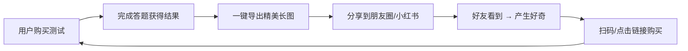

## 1. 市场概述

### 1.1 赛道定义

小红书趣味测试商品，是指在小红书电商平台上以**虚拟商品**形式售卖的在线心理/性格/趣味测试产品。用户下单后通过自动发货获得**测试链接 + 激活码**，完成测试后获取个性化结果报告。这是一种典型的**零库存、零物流、自动化交付**的数字商品模式。

### 1.2 市场规模与热度

- 性格测试已成为年轻人的**新社交货币**，以 MBTI 为首的性格测试在抖音、B站、小红书等平台热榜上几乎从未缺位
- 全球每年超过 **200 万人**参加 MBTI 测试，美国约 200 个联邦机构曾对员工进行 MBTI 测评
- 拥有 MBTI 正版版权的 CCP 公司每年创造**千万美金级**收益
- 豆瓣"人格气质心理"小组聚集 **26 万+** 成员，每天讨论性格类型
- 小红书头部卖家（如"言策的店"）已售 **6.6 万件**，好评率 97.8%
- 36氪报道：0.99元黑暗人格测试刷屏，有卖家靠此**月入过万**

### 1.3 市场驱动力

1. **自我探索需求**：当代年轻人热衷探索自我，性格测试满足了"了解自己"的深层心理需求
2. **社交分享属性**：测试结果天然具备社交传播力，用户会主动在朋友圈/小红书分享
3. **低决策门槛**：¥0.99~¥3.9 的价格几乎无决策成本，冲动购买率极高
4. **巴纳姆效应加持**：测试结果多采用积极正面的描述，提升用户满意度和分享意愿
5. **平台政策利好**：小红书对虚拟商品友好，0 押金开店、支持自动发货、百万免佣等激励政策

---

## 2. 用户画像分析

### 2.1 核心用户群体

| 维度 | 特征描述 |
| --- | --- |
| 年龄 | 18~30 岁为主力，Z 世代和千禧一代占比超 75% |
| 性别 | 女性用户占比约 70%~80%，与小红书整体用户结构一致 |
| 地域 | 一二线城市为主，三四线城市渗透率持续提升 |
| 消费特征 | 乐于尝鲜、追求个性化体验、愿意为精神消费付费 |
| 行为特征 | 强社交分享意愿，测试完成后倾向于发布笔记/朋友圈 |

### 2.2 用户动机拆解

- 🔍 **自我认知**：希望通过测试更好地了解自己的性格、优势和短板
- 💬 **社交货币**：MBTI 类型已成为社交简介标配（"我是 INFP"），测试结果是社交谈资
- 🎮 **娱乐消遣**：碎片时间里的轻度娱乐，类似刷短视频的"信息零食"
- 💕 **情感关系**：情侣/朋友一起测试，探讨匹配度和相处之道
- 📸 **内容创作**：博主/KOL 使用测试结果作为内容素材，带动二次传播

---

## 3. 竞品格局分析

### 3.1 主要竞品类型

| 类型 | 代表产品 | 定价 | 特点 |
| --- | --- | --- | --- |
| 小红书店铺卖家 | 言策的店、各类个人店铺 | ¥0.99~¥3.9 | 走量模式，自动发货链接+激活码 |
| H5 模板平台 | 稿定设计、易企秀等 | 免费/付费模板 | 提供通用H5测试模板，可快速搭建 |
| SaaS 测试平台 | 问卷星、金数据等 | 按功能收费 | 功能完整但缺乏趣味性和视觉设计 |
| 独立站/小程序 | 各类心理测试小程序 | 免费/内购 | 通过广告或增值服务变现 |

### 3.2 头部卖家深度分析

以小红书头部卖家为例：

- **累计销量**：6.6 万件+
- **好评率**：97.8%
- **定价策略**：¥0.99~¥3.9，以低价走量为核心
- **品类覆盖**：MBTI 性格测试、城市性格匹配、黑暗三角人格、爱情语言、天赋测试等
- **交付方式**：链接 + 激活码，支持自动发货
- **运营策略**：种草笔记引流 → 店铺成交 → 用户自发分享形成口碑循环

### 3.3 竞品核心痛点

<aside>
⚠️

通过调研和体验，当前市面上的测试题商品普遍存在以下问题：

1. **UI 同质化严重** — 大多使用同一套 H5 模板，视觉体验千篇一律
2. **题型单一** — 几乎全是纯文字单选题，缺乏交互创新
3. **结果页缺乏冲击力** — 简单文字描述，无可视化元素，无法直接生成分享图
4. **技术门槛低导致竞争激烈** — 模板化生产使得同质化竞品大量涌入
5. **一套测试一个站点** — 维护成本高，扩展性差
</aside>

---

## 4. 热门品类与趋势

### 4.1 当前热门测试品类

1. **MBTI 16 型人格测试** — 长青品类，持续高需求
2. **城市性格匹配** — "你的性格最像哪座城市"，话题感强
3. **黑暗三角人格测试** — 近期爆火（36氪报道 0.99 元刷屏），探索人格阴暗面
4. **爱情语言测试** — 情侣向，适合双人互动
5. **天赋/职业倾向测试** — 与职业规划强关联，付费意愿高
6. **前世今生/命运测试** — 娱乐性强，分享率高
7. **年上/年下吸引力测试** — 社交话题性强

### 4.2 品类趋势判断

| 趋势方向 | 分析 | 机会等级 |
| --- | --- | --- |
| 交互创新 | 从纯文字单选 → 图片选择/滑块/拖拽等多元题型 | ⭐⭐⭐⭐⭐ |
| 视觉升级 | 精美 UI + 动画过渡，打造沉浸式答题体验 | ⭐⭐⭐⭐⭐ |
| 结果可视化 | 雷达图/匹配度/标签体系，替代纯文字结果 | ⭐⭐⭐⭐⭐ |
| 长图导出 | 一键生成精美分享长图，自带传播属性 | ⭐⭐⭐⭐⭐ |
| IP 联名/主题化 | 结合热门 IP、节日、热点事件推出限定测试 | ⭐⭐⭐⭐ |
| 多人互动 | 情侣/闺蜜双人测试、匹配度对比 | ⭐⭐⭐⭐ |

---

## 5. 商业模式分析

### 5.1 收入模型

```
月收入 = 日均订单数 × 客单价 × 30
```

| 场景 | 日均单量 | 客单价 | 月收入 | 月成本 | 月利润 |
| --- | --- | --- | --- | --- | --- |
| 冷启动期 | 10~30 | ¥1.99 | ¥600~¥1,800 | ≈¥0 | ¥600~¥1,800 |
| 成长期 | 50~100 | ¥2.49 | ¥3,750~¥7,500 | ≈¥0 | ¥3,750~¥7,500 |
| 成熟期 | 200~500 | ¥2.99 | ¥18,000~¥45,000 | ≈¥36 | ≈¥18,000~¥45,000 |
| 规模期 | 500~1000 | ¥2.99 | ¥45,000~¥90,000 | ≈¥36 | ≈¥45,000~¥90,000 |

> 虚拟商品几乎 100% 毛利率，运营成本趋近于零，是极高利润率的商业模式。
> 

### 5.2 定价策略建议

- **引流款**：¥0.99，低门槛吸引首次用户，培养购买习惯
- **主力款**：¥1.99~¥2.99，核心利润来源，覆盖大部分热门测试
- **高端款**：¥3.9~¥5.9，深度测试/多维度报告，满足进阶用户需求
- **组合包**：¥6.9~¥9.9，打包 3~5 套测试，提升客单价

### 5.3 成本结构

基于当前的 Cloudflare 架构设想，项目前期的基础设施成本应控制在 **接近 0 到很低** 的区间，而不是“必然长期 0 元”。

- 域名：¥0（已有域名）
- 前端托管：优先使用 Cloudflare Pages 免费层
- API：优先使用 Pages Functions / Workers 免费层
- 数据库：优先使用 D1 免费层
- 缓存：KV 仅作缓存，不承担业务真相源
- 对象存储：R2 承担素材与发布产物存储
- 第三方支出：主要来自自动发货 SaaS、平台保证金等外部成本

> 结论上仍然成立：这是一个非常适合低成本走量的业务模型；但文档表述应从“绝对 0 成本”调整为“前期接近 0、总体极低、以官方当期免费额度为准”。

---

## 6. 小红书平台运营策略

### 6.1 店铺搭建

- **开店类型**：个人店（身份证注册，0 费用，保证金 ¥1000）
- **商品类目**：虚拟商品/服务类
- **发货方式**：自动发货（链接 + 激活码）
- 利用平台**百万免佣**和**新商激励**政策降低前期成本

### 6.2 内容运营策略

| 内容类型 | 目的 | 示例 |
| --- | --- | --- |
| 测试结果展示 | 种草引流 | "测了城市性格匹配，竟然最像巴黎！" |
| 对比向内容 | 激发好奇 | "INFP vs ENTJ 做同一套测试，结果差距太大了" |
| 情侣/闺蜜互动 | 拉动双人消费 | "和男朋友一起测了爱情语言，原来我们差这么多" |
| 结果长图分享 | 二次传播 | 精美长图自带店铺二维码，用户主动分享 |
| 热点蹭话题 | 获取流量 | 结合热播剧/综艺推出角色性格测试 |

### 6.3 增长飞轮



核心逻辑：**测试结果本身就是最好的广告**。通过长图导出 + 二维码嵌入，每一次用户分享都是一次免费的获客。

---

## 7. 灵测 SoulTest 的差异化竞争优势

### 7.1 竞争力对比

| 维度 | 当前竞品 | 灵测 SoulTest | 优势程度 |
| --- | --- | --- | --- |
| 题型丰富度 | 纯文字单选题 | 8+ 种交互题型（图片选择/滑块/拖拽/情景模拟等） | ⭐⭐⭐⭐⭐ |
| UI 品质 | 模板化、同质严重 | Tailwind + Framer Motion 精美动画 | ⭐⭐⭐⭐⭐ |
| 结果呈现 | 简单文字 | 匹配度可视化 + 标签 + 雷达图 + 详细分析 | ⭐⭐⭐⭐⭐ |
| 分享体验 | 手动截屏（质量差） | 一键导出精美长图 + 二维码 | ⭐⭐⭐⭐⭐ |
| 扩展效率 | 一套测试一个站 | JSON 配置驱动，分钟级上新 | ⭐⭐⭐⭐⭐ |
| 运营成本 | 需要服务器/SaaS | Cloudflare 全家桶前期接近 0、总体极低 | ⭐⭐⭐⭐⭐ |
| 计分灵活度 | 简单计分 | 计分制/分支制/加权制/维度制 | ⭐⭐⭐⭐ |

### 7.2 核心壁垒

1. **体验壁垒** — 精美 UI + 多样交互 + 动画过渡，短时间内难以复制
2. **效率壁垒** — JSON 驱动的平台化架构，新增测试只需配置文件，远超竞品的上新速度
3. **传播壁垒** — 长图导出自带二维码，每次分享 = 免费获客，形成增长飞轮
4. **成本壁垒** — 早期基础设施成本极低，支持更激进的定价策略或更高的利润率

---

## 8. 风险与挑战

### 8.1 主要风险

| 风险类别 | 描述 | 应对策略 |
| --- | --- | --- |
| 平台政策风险 | 小红书可能调整虚拟商品政策或抽佣比例 | 多平台布局（淘宝/拼多多/抖音），降低单一平台依赖 |
| 内容合规风险 | 心理测试类内容可能涉及敏感领域 | 避免涉及医疗/心理诊断，定位"趣味娱乐测试" |
| 竞品模仿风险 | UI 和交互创新被竞品快速模仿 | 持续迭代 + 快速上新 + 品牌化运营建立认知壁垒 |
| 激活码安全风险 | 激活码被破解或共享 | 一码一用 + 设备绑定 + 时效限制 |
| 用户疲劳风险 | 测试类内容新鲜感下降 | 持续研发新品类 + 结合热点快速推出限定测试 |

### 8.2 法律合规注意事项

- 避免使用"心理咨询""心理诊断"等专业术语，明确定位为**趣味娱乐测试**
- 测试结果声明"仅供娱乐参考，不构成专业心理学建议"
- 不收集用户敏感个人信息，遵守《个人信息保护法》
- 商品描述不做效果承诺，避免虚假宣传
- 对题库来源做分级管理：可直接商用、可改编后谨慎使用、仅可参考不可直接商用
- 对带非商用限制或品牌版权风险的资源，不直接放入付费商品

---

## 9. 结论与建议

### 9.1 市场判断

<aside>
✅

小红书趣味测试商品是一个**高利润率、低门槛、强传播属性**的蓝海细分市场。市场需求真实且持续增长，当前竞品普遍存在体验同质化的痛点，为 灵测 SoulTest 提供了明确的差异化切入点。

</aside>

### 9.2 关键行动建议

1. **首批测试选品**：优先上线城市性格匹配（话题性强）、黑暗三角人格测试（近期爆火）、社死指数等轻量题；MBTI 类测试需求强，但需先处理题库版权与文案改编问题
2. **定价策略**：首发 ¥0.99 引流 + ¥1.99~¥2.99 主力款，快速积累销量和评价
3. **差异化打造**：聚焦"交互体验 + 视觉品质 + 长图导出"三大核心差异点
4. **内容先行**：在店铺上线前先发布测试结果展示类笔记，测试市场反馈和内容方向
5. **快速迭代**：利用 JSON 配置优势，保持每周 1~2 套新测试的上新节奏
6. **数据驱动**：追踪每套测试的完成率、分享率、复购率，优化题目设计和结果呈现

### 9.3 目标里程碑

| 时间节点 | 目标 | 关键指标 |
| --- | --- | --- |
| 第 1 个月 | MVP 上线 + 首套测试开售 | 日均 10+ 单 |
| 第 2 个月 | 3 套测试上线 + 口碑积累 | 日均 30~50 单，好评率 > 95% |
| 第 3 个月 | 10 套测试 + 增长飞轮启动 | 月销 5000+ 单，长图分享率 > 30% |
| 第 6 个月 | 品类领先 + 品牌化 | 月销 10000+ 单，复购率 > 20% |

---

*本报告基于公开市场数据、竞品调研及行业趋势分析撰写，数据截至 2026 年 3 月。*
